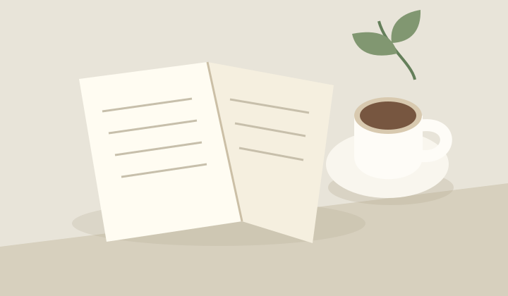

# 把日子过成<br>喜欢的样子

不必一次改变全部。先从一张干净的桌子、一本想读的书开始，给普通的一天留一点期待。

> **今日小提醒**
>
> 生活的秩序感，来自那些能轻松重复的小事。

## 01 / 留一点空白

每天给自己 **20 分钟不被打扰的时间**。可以看书、散步，也可以什么都不做。让注意力回到眼前，比把待办清单填满更重要。



## 02 / 把目标变小

1. 从一页书开始，不急着读完一整本。
2. 只整理桌面的一角，给常用物品固定的位置。
3. 记录今天做成的一件事，而不是遗漏的十件事。

### 给忙碌日子的备用方案

- 只剩五分钟：打开窗，伸展一下。
- 状态不够好：把任务减半，允许慢一点。
- 连续中断几天：从今天重新开始。

---

## 03 / 找到自己的节奏

| 场景 | 一个小动作 |
| --- | --- |
| 早上 | 先喝水，再看消息 |
| 午后 | 离开屏幕走几步 |
| 晚上 | 写下明天最重要的一件事 |

> [!TIP]
> 不需要照搬别人的日程。选一个适合自己的动作，先试三天。

用 `每日记录` 保存观察，也可以写成一个简单的模板：

```text
今天让我开心的一件事：
明天想继续的小习惯：
```

**先行动，再慢慢调整。** 你不需要完美的一天，也可以拥有舒服的生活。
